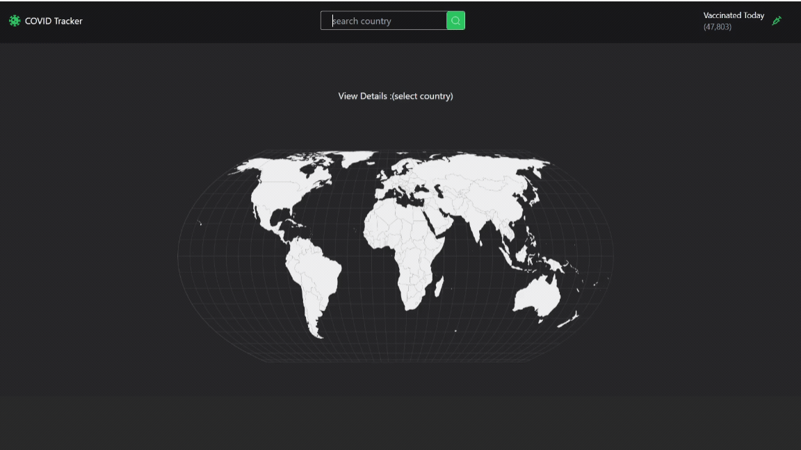

## Application de Suivi COVID

Cette application est développée pour aider les utilisateurs à suivre les nombres de cas actuels et d'autres informations importantes pendant la pandémie de COVID-19. L'interface permet de visualiser les données COVID-19 dans le monde entier et pour des pays spécifiques. Vous pouvez utiliser des graphiques et des outils statistiques pour analyser les données en détail.

## Bibliothèques Utilisées

- react-router-dom
- react-icons
- tailwind
- react-simple-maps
- @reduxjs/toolkit
- react-redux
- @testing-library/- - - user-event@14.0
- axios@^0.27.2
- react-testing-library
- jest

### API

1.API (Pour les données COVID): https://rapidapi.com/axisbits-axisbits-default/api/covid-19-statistics/playground/apiendpoint_191c58c7-a995-4024-a5ee-41043d79e542

2.API: (Pour les informations sur les pays): https://restcountries.com/

### Gif

